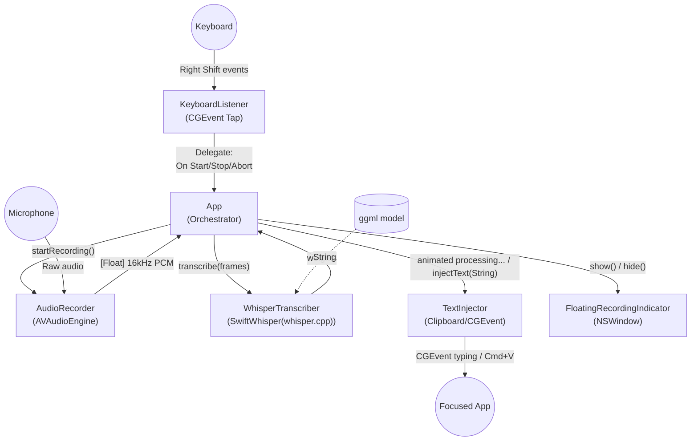

# Voicetyper

A lightning-fast, native macOS voice-to-text app powered by **whisper.cpp** for fully **local, offline** speech recognition. Hold a key, speak, release — your transcribed text appears in whatever app is focused. No cloud APIs, no API keys, no internet required, choose the most suitable model for your needs.

## How to Use

1. **Install** the app.
2. **Press and hold** the `Right Shift` button.
3. **Talk!** (Release to automatically type your text).

## Features

- **Hold-to-Talk**: Hold `Right Shift` to speak, release to transcribe and type.
- **Grace Period**: Briefly pause mid-sentence (up to 400ms) without chopping your audio into separate chunks.
- **Double-Tap Abort**: Rapidly double-tap `Right Shift` within 400ms to silently discard the recording.
- **Silence Rejection**: Automatically detects dead audio and drops the transaction — no accidental typing.
- **Clipboard Preservation**: Borrows your clipboard for ~500ms to paste text, then restores your original clipboard contents.
- **Fully Offline**: Uses whisper.cpp locally — no Gemini, no OpenAI, no network calls.
- **Pulsing Indicator**: An elegant floating microphone icon visually pulses at the bottom of your screen to clearly indicate active recording status.
- **Animated Typing**: Injects a live `processing...` placeholder directly into your text field while the audio is being transcribed to provide instant visual feedback.
- **Menu Bar App**: Shows a simple mic icon in your menu bar while running. (Note: the app runs via your terminal, where detailed 🔴 recording and ⏳ processing state indicators are logged).
## Prerequisites

- macOS 13+ (Tested on Apple Silicon)
- Swift 6.0+
- ~142MB disk space for the default whisper model

## Quick Install

The easiest way to install VoiceTyper is via the automatic installation script. Simply open your terminal and run:

```bash
curl -sSL https://raw.githubusercontent.com/burubur/voicetyper/main/install.sh | bash
```

Alternatively, if you have already cloned the repository locally, you can simply run:
```bash
make install
```

This will automatically check for prerequisites, clone the repository (if using curl), build the application, download the default `ggml-base.en.bin` whisper model, and securely install the binary into your `/usr/local/bin`.

### Running the App

After installation, simply open your terminal and run:

```bash
voicetyper
```

*(Note: You must keep the terminal window open while using the app. It will run quietly in the background, showing a simple mic icon in your menu bar.)*

### Uninstall

If you ever wish to completely remove the app from your machine along with its models, simply run:

```bash
curl -sSL https://raw.githubusercontent.com/burubur/voicetyper/main/uninstall.sh | bash
```

Alternatively, if you cloned the repository locally, you can run:
```bash
make uninstall
```

---

## Manual Setup

### 1. Download a Whisper Model

```bash
make download-models
```

Running this command will invoke the background script and automatically download **all available models**. The downloaded models will be located in the relative path: `~/.voicetyper/`, allowing you to test which one performs the best on your machine.

If you prefer to preserve disk space, you can choose to download only a single model by passing its namespace exactly as shown directly to the bash script:

```bash
./download-models.sh ggml-tiny.en.bin            # ~75MB  — fastest, least accurate
./download-models.sh ggml-base.en.bin            # ~142MB — good balance (recommended)
./download-models.sh ggml-small.en.bin           # ~466MB — more accurate
```

### 2. Configuration (Optional)

By default, VoiceTyper uses `ggml-base.en.bin`. If you've downloaded a different model, you can configure the app to use it.

**For normal users:**
Set the environment variable in your terminal before running the app:
```bash
export WHISPER_MODEL=ggml-small.en.bin
voicetyper
```
Alternatively, write to macOS defaults so it persists:
```bash
defaults write VoiceTyper WHISPER_MODEL ggml-small.en.bin
```

**For developers (local build):**
1. Create a file named `.xcconfig` inside the `voicetyper` root folder.
2. Add your desired model name:
```bash
WHISPER_MODEL=ggml-base.en.bin
```

When you launch VoiceTyper, it will automatically search these configurations and load the appropriate model from `~/.voicetyper/`.

### 3. Build & Run

You must run VoiceTyper from your terminal, and **keep the terminal window open** while using it.

For the best performance, build the "release" version and execute the resulting binary:

```bash
# 1. Compile the app
swift build -c release

# 2. Run the application from your terminal
.build/release/VoiceTyper
```

*(Note: If you run just `swift build`, you must run `.build/debug/VoiceTyper` instead!)*

### 3b. Development Mode (Auto-Reloading)

If you are modifying the code and want the app to automatically recompile and restart whenever you save a file, you can use `watchexec`.

1. Install `watchexec` via Homebrew:
```bash
brew install watchexec
```
2. Run this command in the project root:
```bash
make debug
```
Whenever you save a `.swift` file, the app will instantly terminate, re-compile, and re-launch!

### 4. Grant Permissions

On first launch, macOS will prompt for:
- **Microphone Access**: Required to capture audio.
- **Accessibility Access**: Required to monitor keyboard and inject text.

Go to **System Settings > Privacy & Security** to grant both.

## Usage

By default, VoiceTyper runs entirely silently in your Mac's background. You will know it's active when you see the small mic icon in your top menu bar.

If you specifically wish to see diagnostic logs, ML inference weights, and transcription stats, you can run the app manually in **Debug Mode**:
```bash
voicetyper --debug
```

### How to type:
1. Click into any text field (editor, browser, chat app, etc.).
2. **Hold `Right Shift`** — a pulsing floating microphone appears at the bottom of your screen, recording begins, and the terminal logs a 🔴 recording state.
3. **Speak normally** into your microphone.
4. **Release `Right Shift`** — the app types an animated `processing...` placeholder in your text field, whisper.cpp transcribes locally, and the terminal logs a ⏳ processing state.
5. Once finished, the placeholder is deleted and your transcribed text is instantly injected.

### Shortcuts

| Action | Gesture |
|--------|---------|
| Record | Hold `Right Shift` |
| Pause & resume (grace period) | Release < 400ms, hold again |
| Abort recording | Double-tap `Right Shift` rapidly |
| Force stop processing | Press `Ctrl + C` |
| Quit | Menu bar icon → "Quit VoiceTyper" |

## Troubleshooting

- **No text is being typed (or only `processing...` appears):** macOS accessibility permissions can sometimes fail to register after an update. Go to **System Settings > Privacy & Security > Accessibility**, remove your terminal app (e.g., Terminal, iTerm) using the `-` button, and re-add it using the `+` button.
- **Microphone not picking up audio:** Ensure you have granted Microphone permissions to your terminal app in **System Settings > Privacy & Security > Microphone**.

## Architecture

### Components


