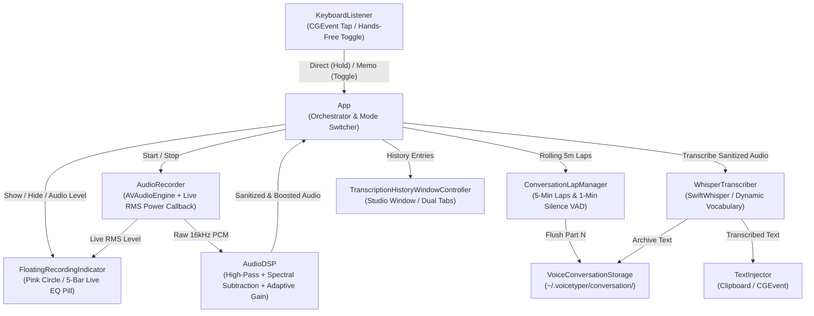

# Voicetyper

A lightning-fast, native macOS voice-to-text app powered by **whisper.cpp** for fully **local, offline** speech recognition. Hold a key to type inline, or toggle hands-free conversation memos — your speech is transcribed natively on Apple Silicon without cloud APIs, subscription costs, or internet connectivity.

## How to Use

1. **Direct Dictation**: Press and hold `Right Option` to speak, release to type at your cursor.
2. **Hands-Free Conversation Memo**: Tap `Shift + Right Option` once to record meetings/brainstorms hands-free. Tap again to stop and archive raw audio WAV + text in `~/.voicetyper/conversation/`.

## Features

- **Direct Dictation (Hold-to-Talk)**: Hold `Right Option` to speak, release to transcribe and type directly at your cursor.
- **Hands-Free Conversation Capture (Toggle)**: Tap `Shift + Right Option` once to talk hands-free; tap again to stop. Automatically segments recordings into **rolling 5-minute laps** to bound memory, and automatically stops on **1 minute of silence**.
- **Native Classical Audio DSP & Adaptive Gain**: 4th-order 80Hz Butterworth high-pass filter cuts 50/60Hz AC hum and laptop fan noise; vDSP spectral subtraction eliminates background hiss; adaptive speech gain & soft-knee normalization boosts quiet speech by up to +18dB to -1.0 dBFS headroom without distortion.
- **Dynamic Vocabulary Biasing**: Injects project glossary terms and code symbols directly into Whisper's prompt context to eliminate phoneme hallucinations on domain technical words.
- **Grace Period**: Briefly pause mid-sentence (up to 800ms) without chopping your audio into separate chunks.
- **Double-Tap Abort**: Rapidly double-tap `Right Option` within 300ms (or click the floating indicator) to silently discard the recording.
- **Silence Rejection**: Automatically detects dead audio and drops the transaction — no accidental typing or blank files.
- **Clipboard Preservation**: Borrows your clipboard for ~500ms to paste text, then restores your original clipboard contents.
- **Dual-Mode Floating Indicator**: Minimalist 34x34px pink circle for direct dictation; 136x34px purple pill with **live 5-bar signal-reactive waveform EQ**, lap counter, and ticking timer for conversation memos.
- **Transcription Studio Window**: Dual-tab macOS GUI window (Transcriptions & Conversations) with hover-to-reveal borderless action buttons (`▷ Play`, `📁 Finder`, `📋 Copy`, `🗑 Delete`), live search, and bounded card layouts.
- **Single-Instance & Zero-Sudo Upgrades**: Automatically terminates stale instances on startup (`~/.voicetyper/voicetyper.pid`) and upgrades seamlessly in user-space (`voicetyper upgrade`).

## Prerequisites

- macOS 13+ (Tested on Apple Silicon / M-series)
- Swift 6.0+
- ~142MB disk space for the default whisper model

## Quick Install

The easiest way to install VoiceTyper is via the automatic installation script. Simply open your terminal and run:

```bash
curl -sSL https://raw.githubusercontent.com/burubur/voicetyper/main/install.sh | bash
```

Alternatively, if you have already cloned the repository locally:
```bash
make install
```

This installs the compiled binary to `~/.local/bin/voicetyper`, downloads the recommended model, and prepares the background agent.

### Running the App

After installation, simply run:

```bash
voicetyper
```

To run in the foreground with verbose debug logging:
```bash
voicetyper --debug
```

### Upgrading

To upgrade your live background installation to the latest source commit with zero `sudo` prompt:
```bash
voicetyper upgrade
```

### Uninstall

```bash
curl -sSL https://raw.githubusercontent.com/burubur/voicetyper/main/uninstall.sh | bash
```
Or locally:
```bash
make uninstall
```

---

## Shortcuts

| Action | Shortcut / Gesture | Behavior |
|--------|-------------------|----------|
| **Direct Dictation** | Hold `Right Option` | Speaks inline, pastes text at cursor on release |
| **Conversation Memo** | Tap `Shift + Right Option` | **Hands-Free Toggle**: 1st tap starts, 2nd tap stops & saves WAV + text |
| **Pause & Resume** | Release < 800ms, hold again | Grace period prevents splitting sentences |
| **Abort Recording** | Double-tap `Right Option` (< 300ms) or click pill | Silently discards audio buffer |
| **Force Stop Processing** | Press `Ctrl + C` | Instantly halts transcription animation and aborts |
| **Show UI Window** | Menu bar icon → "Show VoiceTyper" (`⌘H`) | Opens past transcriptions and model settings |
| **Quit** | Menu bar icon → "Quit VoiceTyper" (`⌘Q`) | Terminates background agent cleanly |

---

## Architecture


```mermaid
graph TD
    %% Components
    App["App<br/>(Orchestrator & Mode Switcher)"]
    KL["KeyboardListener<br/>(CGEvent Tap / Hands-Free Toggle)"]
    AR["AudioRecorder<br/>(AVAudioEngine + Live RMS Power Callback)"]
    DSP["AudioDSP<br/>(High-Pass + Spectral Subtraction + Adaptive Gain)"]
    LM["ConversationLapManager<br/>(5-Min Laps & 1-Min Silence VAD)"]
    WT["WhisperTranscriber<br/>(SwiftWhisper / Dynamic Vocabulary)"]
    TI["TextInjector<br/>(Clipboard / CGEvent)"]
    CS["VoiceConversationStorage<br/>(~/.voicetyper/conversation/)"]
    FRI["FloatingRecordingIndicator<br/>(Pink Circle / 5-Bar Live EQ Pill)"]
    THW["TranscriptionHistoryWindowController<br/>(Studio Window / Dual Tabs)"]

    %% Flow
    KL -- "Direct (Hold) / Memo (Toggle)" --> App
    App -- "Show / Hide / Audio Level" --> FRI
    AR -- "Live RMS Level" --> FRI
    App -- "Start / Stop" --> AR
    AR -- "Raw 16kHz PCM" --> DSP
    DSP -- "Sanitized & Boosted Audio" --> App
    App -- "Rolling 5m Laps" --> LM
    LM -- "Flush Part N" --> CS
    App -- "Transcribe Sanitized Audio" --> WT
    WT -- "Transcribed Text" --> TI
    WT -- "Archive Text" --> CS
    App -- "History Entries" --> THW
```
